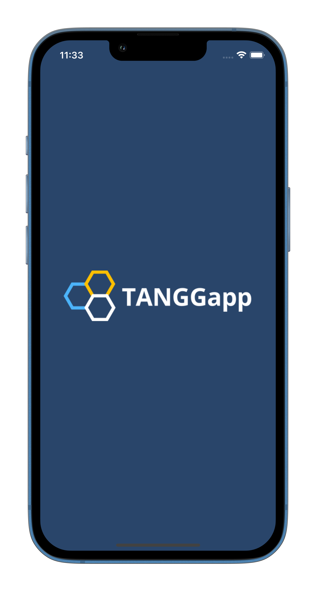
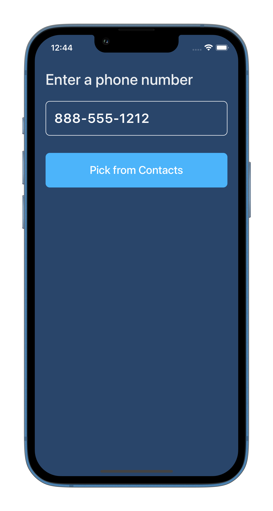
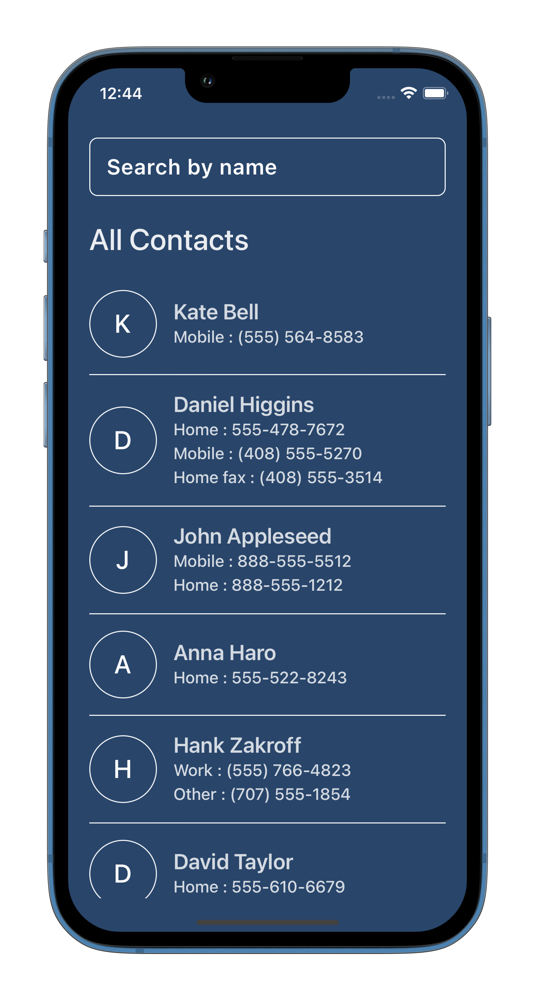
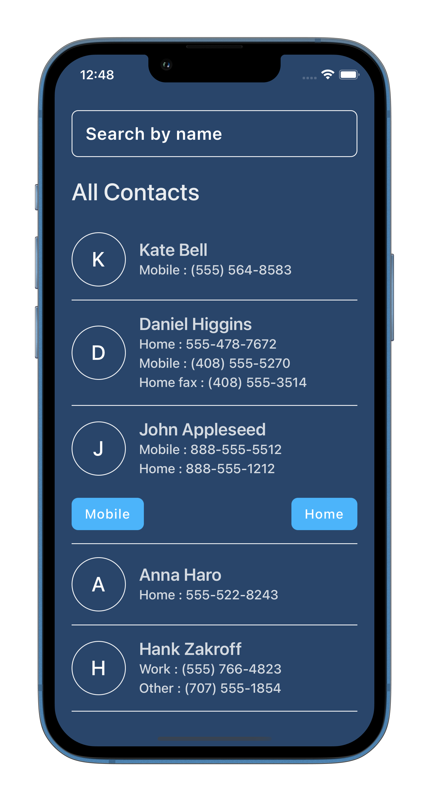
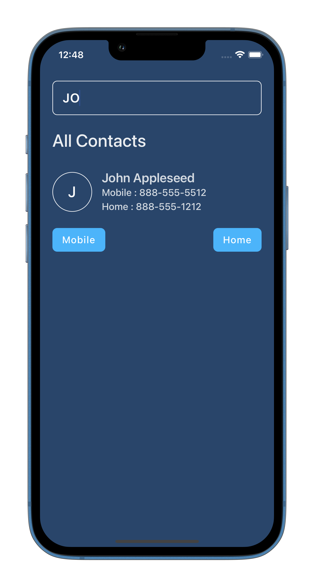
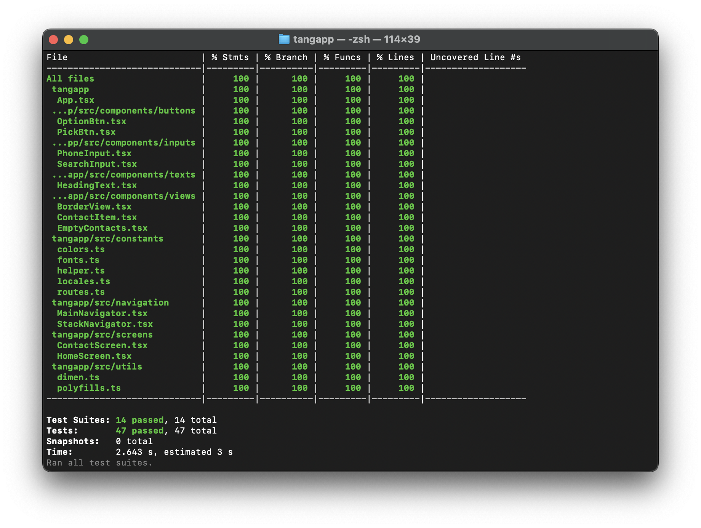

<p align="center">
  <a>
    
  </a>
  <h1 align="center">TANGapp</h1>  
</p>

## Introduction

Send money to the Philippines with the best exchange rates! Money transfers are received in minutes. Get full transparency on your transaction - no FX markups or secret costs.

---

<br>
<br>

<br>
<br>

## :camera_flash: Screenshots

<div align="center" style="margin:auto;width:100%;display:flex;justify-content:center;align-items:center;flex-wrap:wrap;">





</div>

<br>
<br>

## :sparkles: Unit testing

<div align="center" style="margin:auto;width:100%;display:flex;justify-content:center;align-items:center;flex-wrap:wrap;">

</div>

## Development

Make Sure you have [React Native development environment setup](https://reactnative.dev/docs/environment-setup)

```bash
# Install dependencies
yarn install
or
npm install
```

```bash
# Pod installation for ios
cd ios && pod install
```

```bash
# Run android
npm run android
or
yarn android
```

```bash
# Run ios
npm run ios
or
yarn ios
```

```bash
# Run unit tests
npm run test
or
yarn test
```

```bash
# Check test coverage
npm run coverage
or
yarn coverage
```
